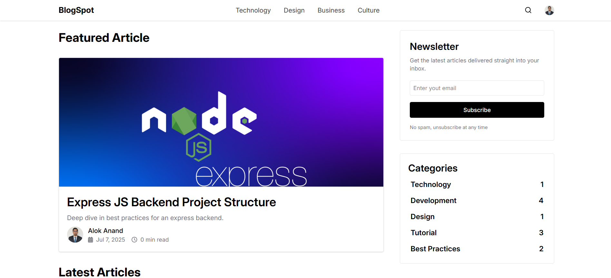
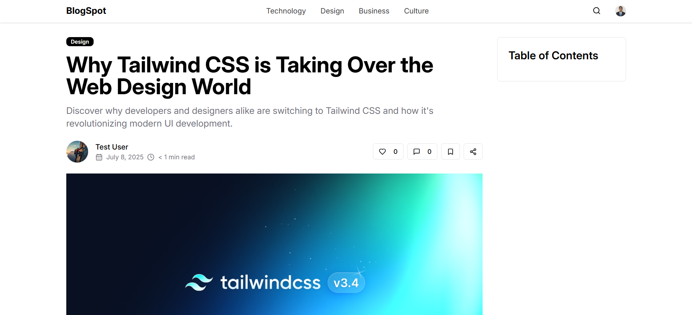
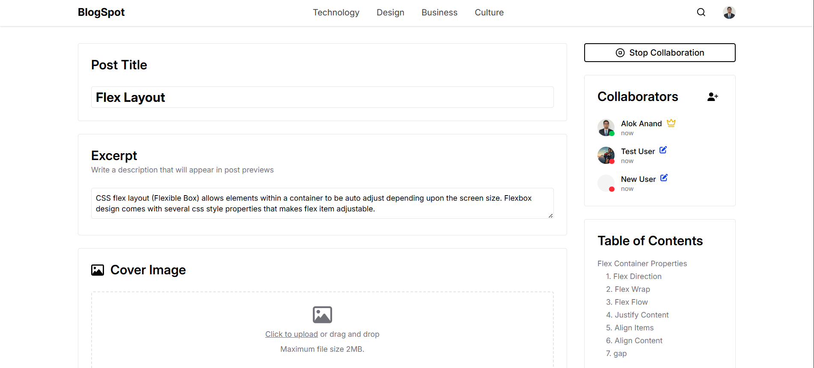
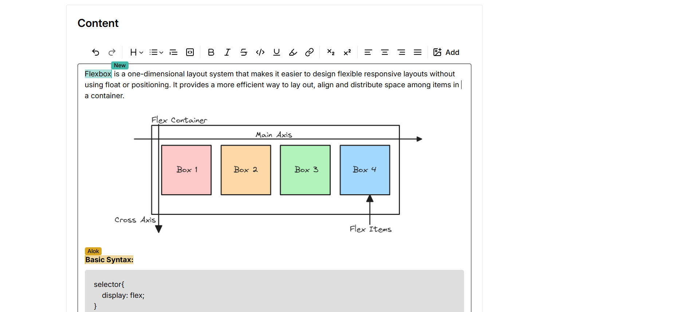
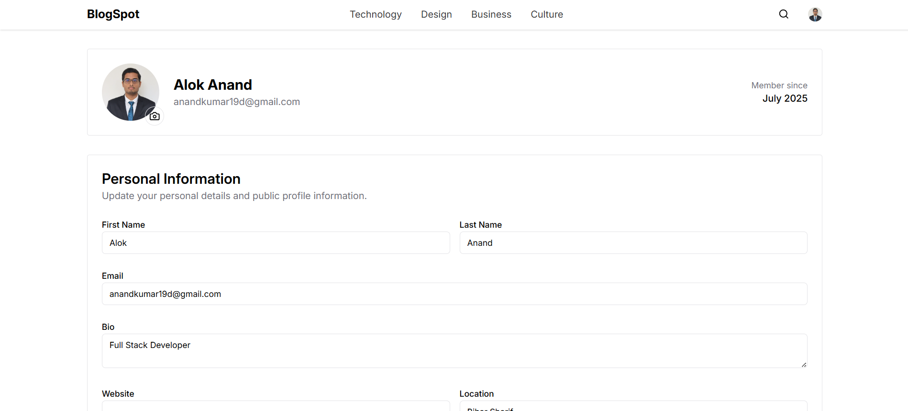
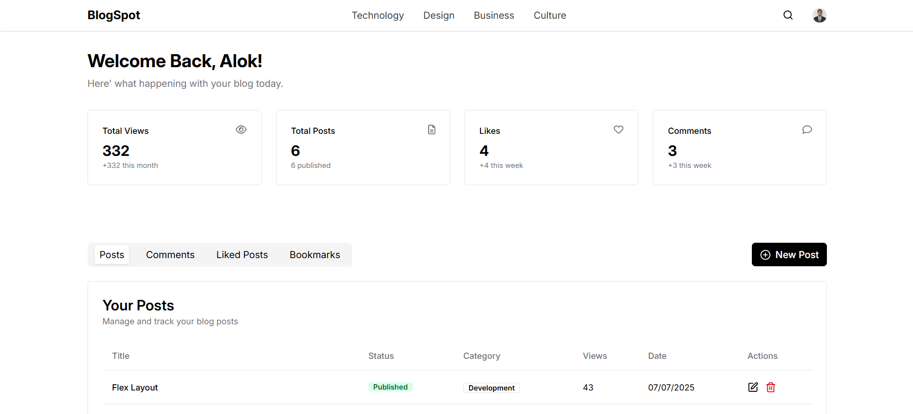

# Blog Spot

Blog Spot is a comprehensive full-stack web application that revolutionizes the blogging experience by combining traditional content creation with cutting-edge real-time collaboration features. Built with modern technologies including React 19, Node.js, and MongoDB, it offers a complete solution for both individual bloggers and collaborative content teams.

## Features

### 🔐 Authentication & User Management
- **User Registration & Login**: Secure signup and signin with email/password
- **OAuth Integration**: Google OAuth authentication for seamless login
- **Password Recovery**: Forgot password functionality with email reset
- **Profile Management**: Update profile information, avatar, and password

### ✍️ Content Creation & Management
- **Rich Text Editor**: Advanced Tiptap editor with collaborative features
- **Real-time Collaboration**: Multiple users can edit posts simultaneously using Yjs
- **Post Categories**: Organize content with customizable categories
- **Draft System**: Save and preview posts before publishing

### 💬 Social Features
- **Comments System**: Nested comments with replies and threading
- **Like/Unlike Posts**: Interactive post engagement
- **Bookmark System**: Save and organize favorite posts
- **View Tracking**: Real-time post view analytics
- **User Interactions**: Track likes, comments, and engagement metrics

### 🏠 Collaborative Rooms
- **Room Creation**: Create collaborative editing spaces
- **Member Management**: Add and remove users from editing rooms
- **Real-time Collaboration**: Multiple authors working on the same content
- **Room Permissions**: Control access to collaborative spaces

### 📊 Dashboard & Analytics
- **User Dashboard**: Personal dashboard with post statistics
- **Post Analytics**: View counts, likes, and engagement metrics
- **Category Analytics**: Track content performance by category
- **User Statistics**: Monitor your blogging activity and growth

### 🔍 Discovery & Search
- **Search Functionality**: Find posts by title, content, or author
- **Related Posts**: AI-powered content recommendations
- **Featured Posts**: Highlighted content showcase
- **Category Filtering**: Browse content by categories

## Tech Stack

**Frontend:**
- React 19
- Redux Toolkit
- Tiptap Editor
- Firebase
- TailwindCSS
- Vite

**Backend:**
- Node.js & Express.js
- MongoDB (Mongoose)
- Zod (validation)
- Cloudinary (image storage)

---

## Dependencies

### Frontend Dependencies
```json
   "dependencies": {
      "@fortawesome/fontawesome-svg-core": "^6.7.2",
      "@fortawesome/free-brands-svg-icons": "^6.7.2",
      "@fortawesome/free-regular-svg-icons": "^6.7.2",
      "@fortawesome/free-solid-svg-icons": "^6.7.2",
      "@fortawesome/react-fontawesome": "^0.2.2",
      "@reduxjs/toolkit": "^2.8.2",
      "@tailwindcss/vite": "^4.0.14",
      "@tiptap/extension-character-count": "^2.24.2",
      "@tiptap/extension-collaboration": "^2.23.0",
      "@tiptap/extension-collaboration-cursor": "^2.23.0",
      "@tiptap/extension-document": "^2.23.0",
      "@tiptap/extension-file-handler": "^2.23.0",
      "@tiptap/extension-highlight": "^2.23.0",
      "@tiptap/extension-image": "^2.23.0",
      "@tiptap/extension-link": "^2.23.0",
      "@tiptap/extension-paragraph": "^2.23.0",
      "@tiptap/extension-placeholder": "^2.23.1",
      "@tiptap/extension-subscript": "^2.23.0",
      "@tiptap/extension-superscript": "^2.23.0",
      "@tiptap/extension-table-of-contents": "^2.23.1",
      "@tiptap/extension-task-item": "^2.23.0",
      "@tiptap/extension-task-list": "^2.23.0",
      "@tiptap/extension-text": "^2.23.0",
      "@tiptap/extension-text-align": "^2.23.0",
      "@tiptap/extension-underline": "^2.23.0",
      "@tiptap/react": "^2.23.0",
      "@tiptap/starter-kit": "^2.23.0",
      "axios": "^1.10.0",
      "dompurify": "^3.2.6",
      "firebase": "^11.9.1",
      "lucide-react": "^0.525.0",
      "react": "^19.0.0",
      "react-dom": "^19.0.0",
      "react-redux": "^9.2.0",
      "react-router-dom": "^7.3.0",
      "react-toastify": "^11.0.5",
      "redux-persist": "^6.0.0",
      "tailwindcss": "^4.0.14",
      "y-prosemirror": "^1.3.6",
      "y-protocols": "^1.0.6",
      "y-websocket": "^3.0.0",
      "yjs": "^13.6.27"
   }
```

### Backend Dependencies
```json
   "dependencies": {
      "@y/protocols": "^1.0.6-0",
      "bcryptjs": "^3.0.2",
      "cloudinary": "^2.7.0",
      "cors": "^2.8.5",
      "dotenv": "^16.4.7",
      "express": "^4.21.2",
      "jsonwebtoken": "^9.0.2",
      "lib0": "^0.2.109",
      "mongoose": "^8.10.1",
      "multer": "^2.0.1",
      "nanoid": "^5.1.5",
      "ws": "^8.18.3",
      "zod": "^3.25.67"
   }
```
### Overview of Blog Spot Website








### Installation
1. **Clone the repository:**
```bash
git clone https://github.com/Alok19d/Blog-Spot.git
```

2. **Install backend dependencies:**
```bash
cd backend
npm install
```

3. **Install frontend dependencies:**
```bash
cd frontend
npm install
```

4. **Configure environment variables:**

Copy .env.example to .env in both frontend and backend directories
Fill in required environment variables

5. **Start the development servers:**

Backend:
```bash
cd backend
npm run dev
```

Frontend:
```bash
cd frontend
npm run dev
```

---

## API Endpoints

### Base URL
```
http://localhost:5000/api/v1
```

### 🔐 Authentication Endpoints (`/user`)

| Method | Endpoint | Description | Auth Required |
|--------|----------|-------------|---------------|
| `POST` | `/signup` | Register a new user | ❌ |
| `POST` | `/signin` | Login user with email/password | ❌ |
| `POST` | `/google` | OAuth login with Google | ❌ |
| `GET` | `/profile` | Get user profile information | ✅ |
| `PUT` | `/update-profile` | Update user profile details | ✅ |
| `PUT` | `/update-password` | Change user password | ✅ |
| `PUT` | `/update-avatar` | Upload and update profile picture | ✅ |
| `DELETE` | `/delete` | Delete user account | ✅ |

### 📝 Post Management Endpoints (`/post`)

| Method | Endpoint | Description | Auth Required |
|--------|----------|-------------|---------------|
| `POST` | `/create` | Create a new blog post | ✅ |
| `POST` | `/upload-image` | Upload image for post content | ✅ |
| `GET` | `/preview` | Preview post before publishing | ✅ |
| `PUT` | `/update-post/:postId` | Update existing post | ✅ |
| `DELETE` | `/delete/:postId` | Delete a post | ✅ |
| `GET` | `/post` | Get single post by slug | ❌ |
| `GET` | `/related-posts` | Get related posts recommendations | ❌ |
| `GET` | `/featured-post` | Get featured posts | ❌ |
| `GET` | `/count-by-category` | Get post count by category | ❌ |
| `GET` | `/fetch-posts` | Get paginated posts list | ❌ |
| `GET` | `/dashboard` | Get user's dashboard posts | ✅ |
| `GET` | `/my-posts` | Get current user's posts | ✅ |

### 💬 Comments Endpoints (`/comment`)

| Method | Endpoint | Description | Auth Required |
|--------|----------|-------------|---------------|
| `POST` | `/create` | Create a new comment | ✅ |
| `GET` | `/post/:postId` | Get comments for a post | ❌ |
| `GET` | `/replies/:commentId` | Get replies to a comment | ❌ |
| `GET` | `/likes/:postId` | Get liked comments for a post | ✅ |
| `PUT` | `/like/:commentId` | Toggle like on a comment | ✅ |
| `PUT` | `/edit/:commentId` | Edit a comment | ✅ |
| `DELETE` | `/delete/:commentId` | Delete a comment | ✅ |

### 🔖 Bookmarks Endpoints (`/bookmark`)

| Method | Endpoint | Description | Auth Required |
|--------|----------|-------------|---------------|
| `GET` | `/` | Get user's bookmarked posts | ✅ |
| `GET` | `/status` | Check if post is bookmarked | ✅ |
| `PUT` | `/toggle/:postId` | Toggle bookmark on a post | ✅ |

### 🏷️ Categories Endpoints (`/category`)

| Method | Endpoint | Description | Auth Required |
|--------|----------|-------------|---------------|
| `POST` | `/create` | Create a new category | ✅ |
| `GET` | `/` | Get all categories | ❌ |
| `DELETE` | `/delete/:categoryId` | Delete a category | ✅ |

### 👁️ Views & Likes Endpoints (`/view`)

| Method | Endpoint | Description | Auth Required |
|--------|----------|-------------|---------------|
| `GET` | `/` | Get user's liked posts | ✅ |
| `GET` | `/status` | Get post views and likes count | ❌ |
| `PUT` | `/toggleLike/:postId` | Toggle like on a post | ✅ |

### 📧 Newsletter Endpoints (`/newsletter`)

| Method | Endpoint | Description | Auth Required |
|--------|----------|-------------|---------------|
| `POST` | `/subscribe` | Subscribe to newsletter | ❌ |

### 🏠 Collaborative Rooms Endpoints (`/room`)

| Method | Endpoint | Description | Auth Required |
|--------|----------|-------------|---------------|
| `POST` | `/create` | Create a new collaborative room | ✅ |
| `PUT` | `/add` | Add user to a room | ✅ |
| `GET` | `/join/:roomId` | Get room details | ✅ |
| `PUT` | `/remove` | Remove user from room | ✅ |
| `DELETE` | `/delete/:roomId` | Delete a room | ✅ |

### 🔐 Authentication
Most endpoints require authentication using JWT tokens. Include the token in the Authorization header:
```
Authorization: Bearer <your-jwt-token>
```

### 📁 File Uploads
For endpoints that handle file uploads (like `/update-avatar` and `/upload-image`), use `multipart/form-data` with the appropriate field names.

### 📄 Response Format
All API responses follow a consistent format:
```json
{
  "success": true/false,
  "statusCode": 200,
  "message": "Success message",
  "data": { ... }
}
```

## Contact
For queries or feedback, please contact [Alok](mailto:anandkumar19d@gmail.com).

---